# Project Submission Artifacts

Этот файл собирает все артефакты для сдачи в одном месте: документы, диаграммы и итоговую проверку полноты.

## Task1 - Анализ безопасности данных

Документы:

- [Обзор и охват](Task1/README.md)
- [Проблемные зоны](Task1/problem-zones.md)
- [Матрица защиты и тегирования](Task1/protection-matrix.md)

### P1 - Запись на прием

As-Is:

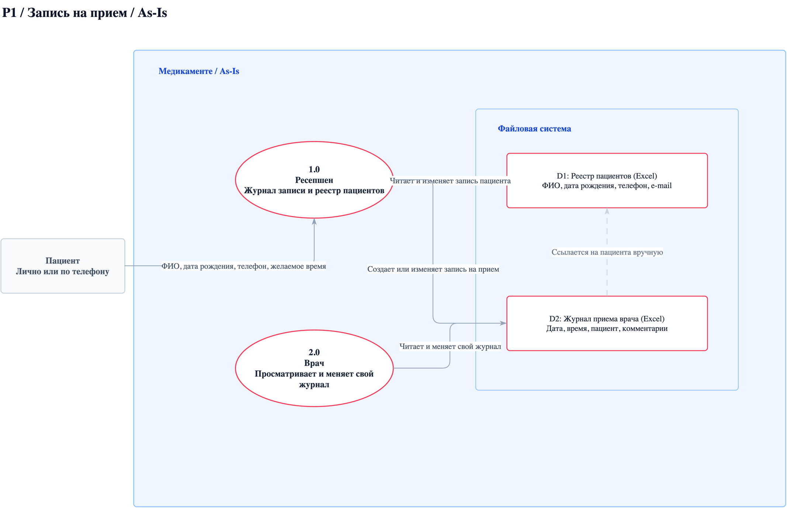

To-Be:

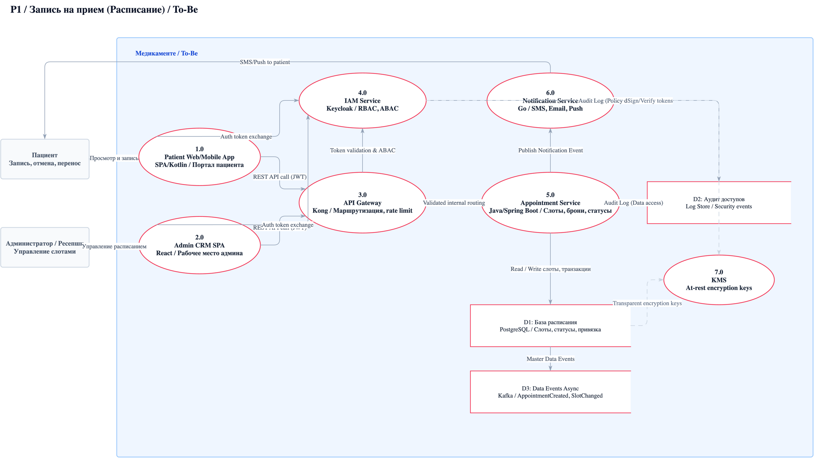

### P2 - Регистрация пациента и медицинские данные

As-Is:

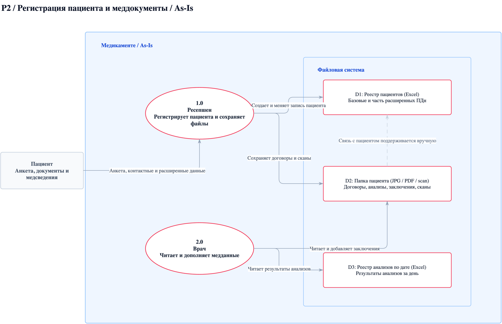

To-Be:

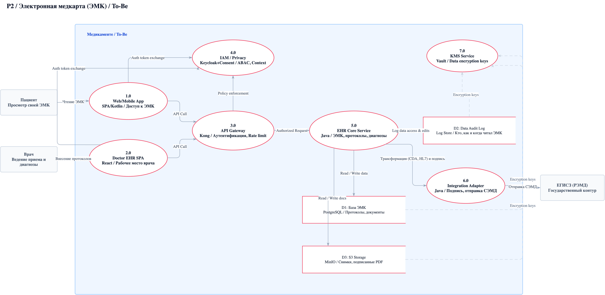

### P3 - Платежи

As-Is:

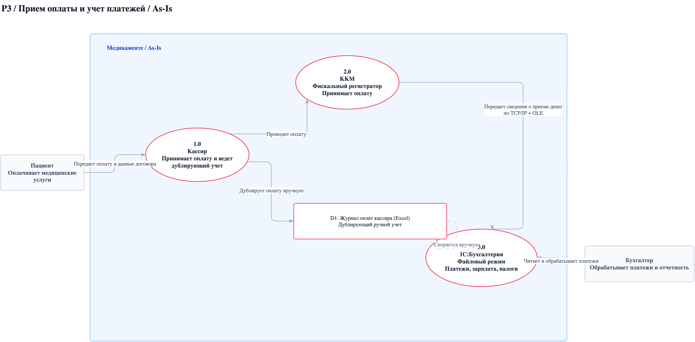

To-Be:

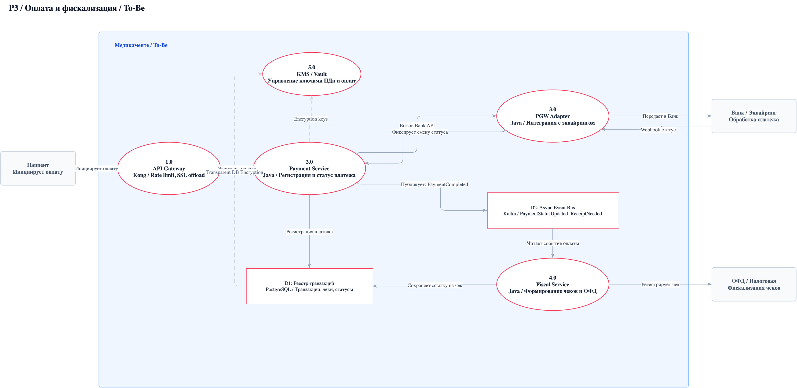

### P4 - Интеграция с лабораторией

As-Is:

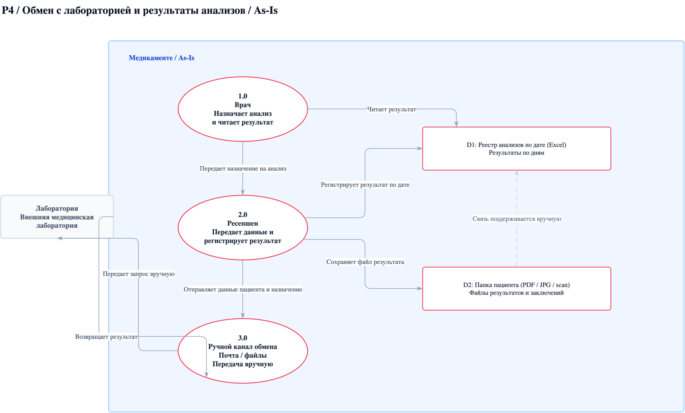

To-Be:

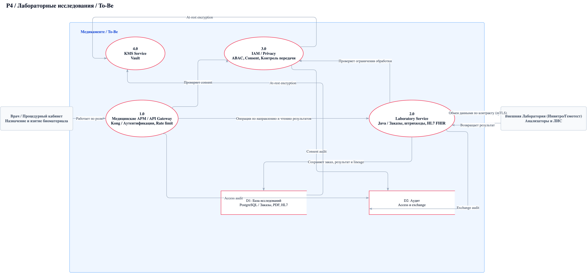

### P5 - Аналитика

As-Is:

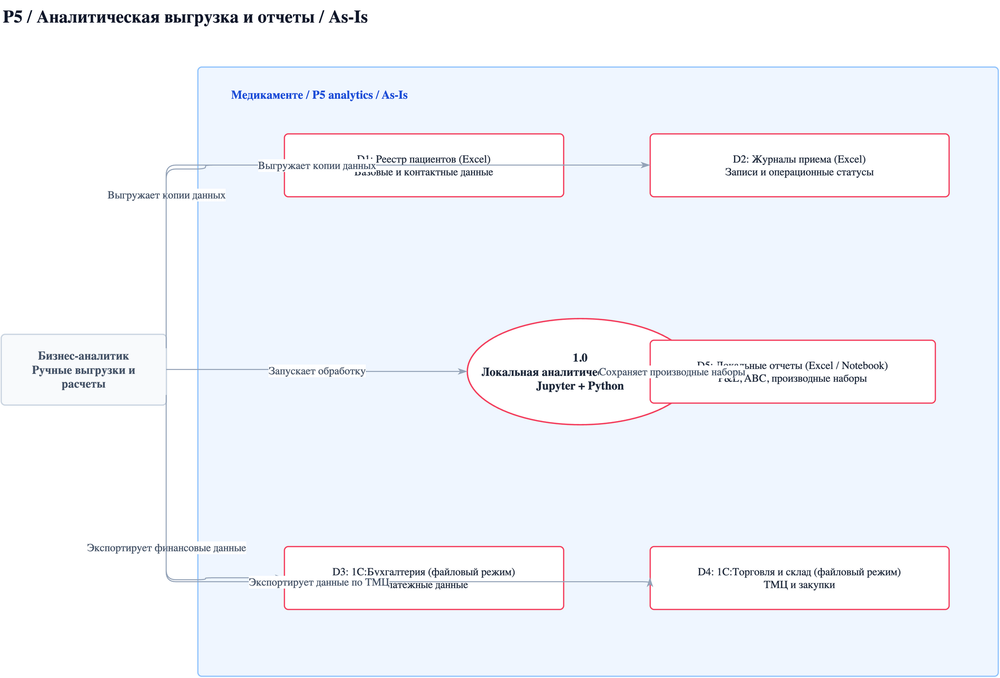

To-Be:

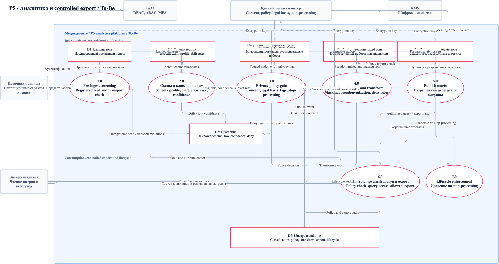

### P6 - Учет ТМЦ и закупок

As-Is:

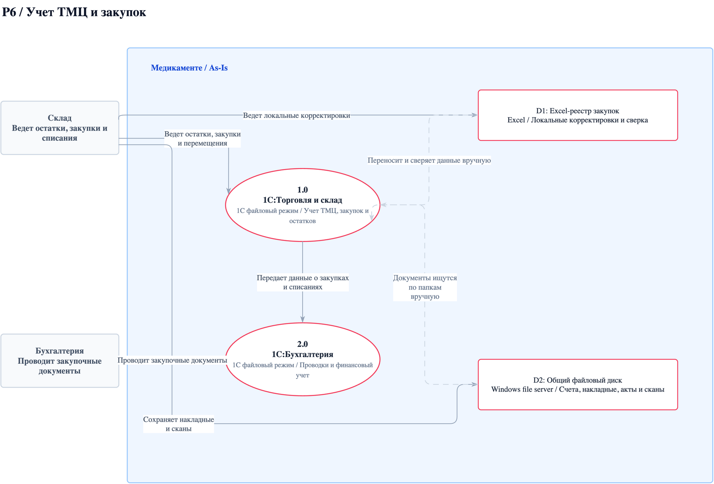

To-Be:

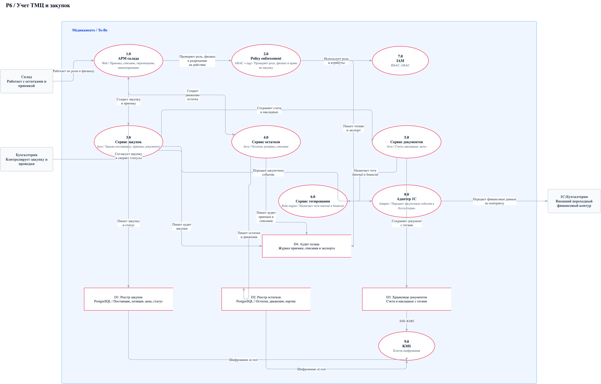

## Task2 - Проектирование решения

Документы и исходники:

- [Описание решения](Task2/README.md)
- [C4 Context MVP - PlantUML](Task2/context-mvp-to-be.puml)
- [C4 Context Target - PlantUML](Task2/context-target-context.puml)

### MVP context

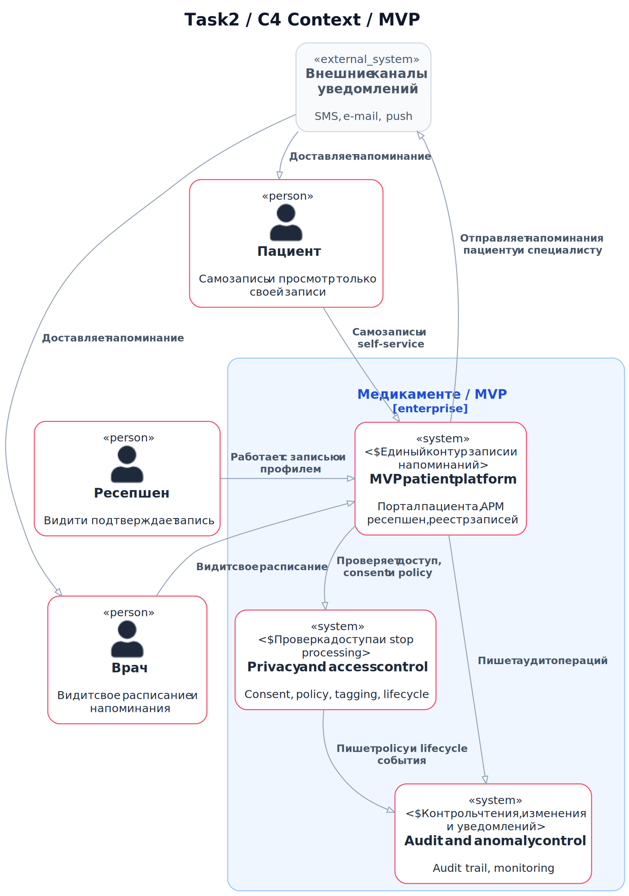

### Target context

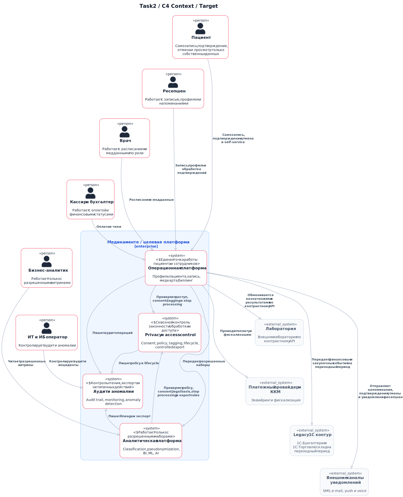

## Task3 - Защита данных at rest и in transit

Документы:

- [Обзор задания](Task3/README.md)
- [Классификация данных и меры защиты](Task3/data-classification.md)
- [Реестр программных и аппаратных средств](Task3/security-tools-register.md)
- [Автоматизированные контроли](Task3/automated-controls.md)

## Task4 - Оценка узких мест миграции

Документы:

- [Описание задания](Task4/README.md)
- [Отчет по узким местам миграции](Task4/bottlenecks-report.md)

### Диаграмма Исикавы

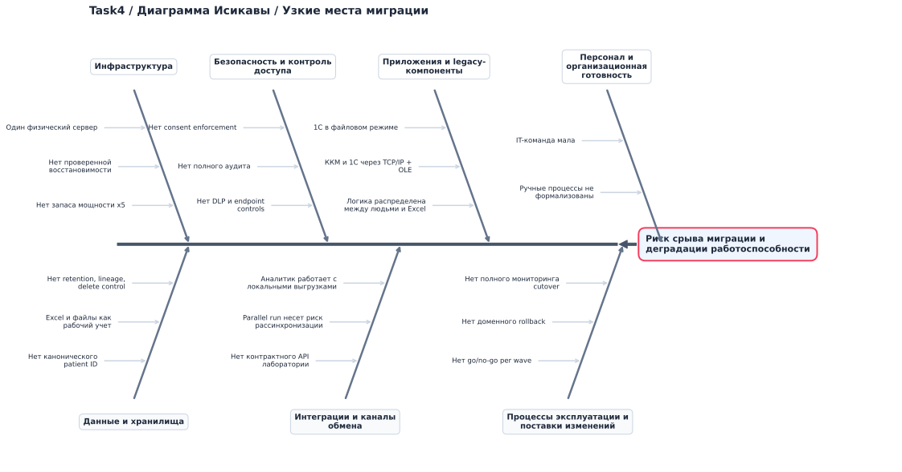

## Task5 - Cutover-план

Документы:

- [Описание задания](Task5/README.md)
- [Выбор стратегии и план переключения](Task5/strategy-and-cutover.md)

## Task6 - Движок классификации данных

Документы и исходники:

- [Описание решения](Task6/README.md)
- [C2 диаграмма - PlantUML](Task6/classification-engine-c2.puml)
- [Executive diagram - PlantUML](Task6/classification-engine-executive.puml)
- [Слои хранения и меры контроля](Task6/storage-layers-and-controls.md)
- [Метрики качества и масштабирования](Task6/metrics-and-scalability.md)

### C2 diagram

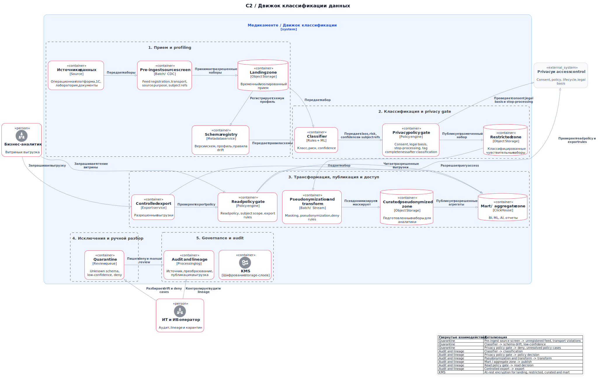

### Executive view

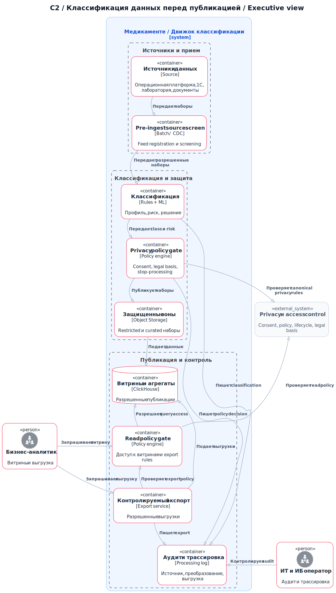
